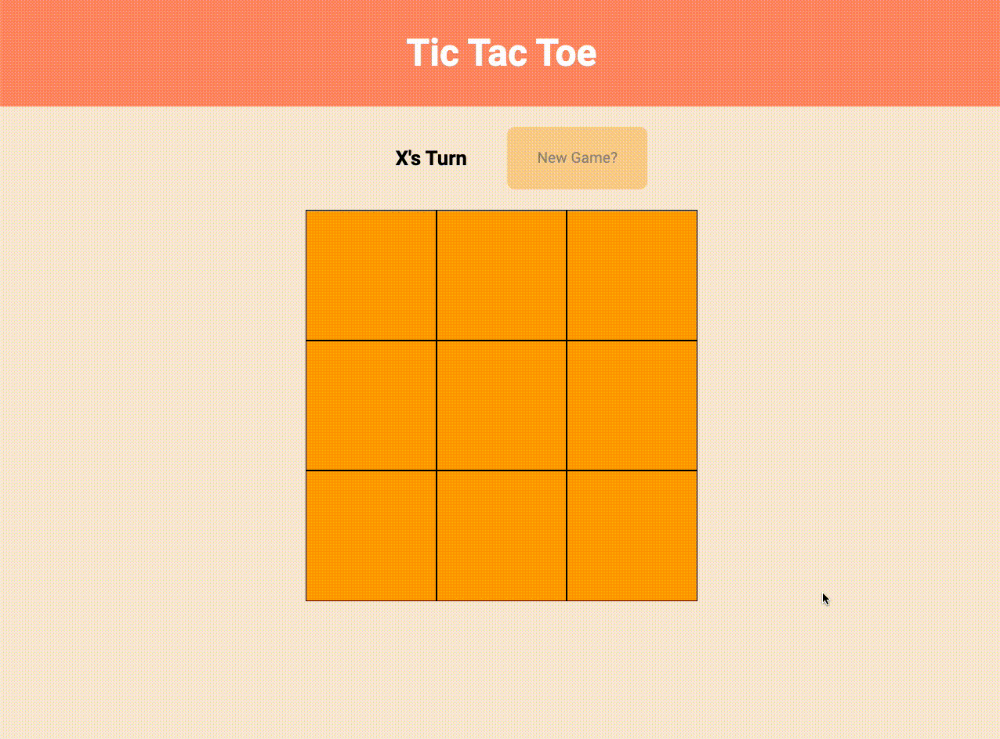

# Tictactoe

- Building the classic family favourite using javascript modules and factory functions. 

👾
<br>
[Live Demo](https://philsmithies.github.io/tictactoe/) 




To Run:
```
git clone https://github.com/philsmithies/tictactoe.git
```

Install Yarn if you don't have it already:
```
npm install --global yarn
```

Run Yarn to initialize
```
yarn
```

Run Tests
```
yarn test
```

Run Program
```
Open index.html in your browser
```

